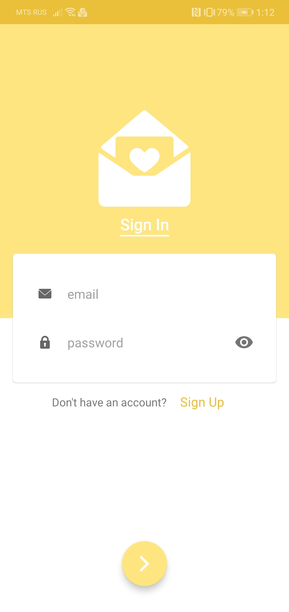

# LifeIsBetter

## Idea
Simple android app, just for practice. 
The main idea is sending to a random man a mail with some good words to make him fill better. Of course user can receive some mails as well,
and he can rate it (how much it's good). There is some information about how many mails of yours were rated as good and how many mails you have already sent.
## How it looks

 

## What it uses
### Android Architecture Components
- [LiveData](https://developer.android.com/topic/libraries/architecture/livedata)
- [ViewModel](https://developer.android.com/topic/libraries/architecture/viewmodel)
- [Navigation](https://developer.android.com/guide/navigation/navigation-getting-started)
- [Paging 3](https://developer.android.com/topic/libraries/architecture/paging/v3-overview)
### Dependency Injection
- [Koin](https://insert-koin.io/)
### Concurrency
- [Coroutines suspend functions](https://kotlinlang.org/docs/reference/coroutines/basics.html)
- [Coroutines Flow](https://kotlinlang.org/docs/reference/coroutines/flow.html)
### Firebase
- [Cloud Messaging](https://firebase.google.com/docs/cloud-messaging) - for notifications
- [Cloud Firestore](https://firebase.google.com/docs/firestore) - to store mails and user info
- [Authentication](https://firebase.google.com/docs/auth) - for authentication
### UI
- [Motion Layout](https://developer.android.com/training/constraint-layout/motionlayout) 

- [Material Components](https://github.com/material-components/material-components-android)
